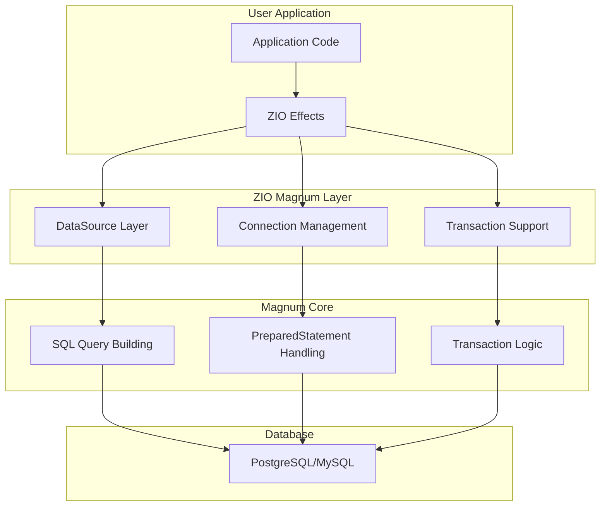

## **ZIO Magnum** - ZIO Integration for the Magnum SQL Library

**ZIO Magnum** is a Scala 3 library that provides seamless integration between [ZIO](https://zio.dev/) and [Magnum](https://github.com/AugustNagro/magnum), a type-safe, composable SQL library. It enables functional programming patterns for database operations using ZIO's powerful concurrency, resource management, and effect system.

### **Architecture Overview**



### **Core Features**

1. **ZIO Resource Management**
   - [`dataSourceLayer()`](modules/zio-magnum/src/main/scala/com/augustnagro/magnum/ziomagnum/package.scala:197) - Creates a HikariCP-based DataSource layer
   - [`customDataSourceLayer()`](modules/zio-magnum/src/main/scala/com/augustnagro/magnum/ziomagnum/package.scala:212) - Allows HikariConfig customization
   - Automatic connection cleanup via ZIO's `Scope`

2. **Connection Management**
   - [`withConnection()`](modules/zio-magnum/src/main/scala/com/augustnagro/magnum/ziomagnum/package.scala:41) - Provides connection from fiber context or creates new one
   - [`fiberRefConnection()`](modules/zio-magnum/src/main/scala/com/augustnagro/magnum/ziomagnum/package.scala:112) - Manages connection lifecycle with finalizers

3. **Transaction Support**
   - [`transaction()`](modules/zio-magnum/src/main/scala/com/augustnagro/magnum/ziomagnum/package.scala:241) - Handles transaction boundaries with automatic commit/rollback
   - Supports nested transactions via fiber-local connection tracking
   - Properly handles auto-commit state

4. **Query Extensions**
   - [`Query.zrun()`](modules/zio-magnum/src/main/scala/com/augustnagro/magnum/ziomagnum/package.scala:329) - Execute query returning `Vector[A]`
   - [`Query.zstream()`](modules/zio-magnum/src/main/scala/com/augustnagro/magnum/ziomagnum/package.scala:339) - Stream results with configurable fetch size
   - [`Frag.zQuery()`](modules/zio-magnum/src/main/scala/com/augustnagro/magnum/ziomagnum/package.scala:422) - Execute raw SQL fragments
   - [`Frag.zUpdate()`](modules/zio-magnum/src/main/scala/com/augustnagro/magnum/ziomagnum/package.scala:429) - Execute UPDATE/INSERT/DELETE

5. **Repository Extensions**
   - **ImmutableRepo** - Read operations: [`zcount`](modules/zio-magnum/src/main/scala/com/augustnagro/magnum/ziomagnum/package.scala:452), [`zFindById`](modules/zio-magnum/src/main/scala/com/augustnagro/magnum/ziomagnum/package.scala:472), [`zFindAll`](modules/zio-magnum/src/main/scala/com/augustnagro/magnum/ziomagnum/package.scala:483)
   - **Repo** - Full CRUD: [`zInsert`](modules/zio-magnum/src/main/scala/com/augustnagro/magnum/ziomagnum/package.scala:559), [`zUpdate`](modules/zio-magnum/src/main/scala/com/augustnagro/magnum/ziomagnum/package.scala:623), [`zDeleteById`](modules/zio-magnum/src/main/scala/com/augustnagro/magnum/ziomagnum/package.scala:520)

6. **Logging**
   - [`Slf4jMagnumLogger.Default`](modules/zio-magnum/src/main/scala/com/augustnagro/magnum/ziomagnum/Slf4jMagnumLogger.scala:19) - Standard SQL logging
   - [`Slf4jMagnumLogger.logSlowQueries()`](modules/zio-magnum/src/main/scala/com/augustnagro/magnum/ziomagnum/Slf4jMagnumLogger.scala:56) - Log only slow queries

### **Usage Example**

```scala
import com.augustnagro.magnum.*
import com.augustnagro.magnum.ziomagnum.*

@SqlName("users")
@Table(PostgresDbType, SqlNameMapper.CamelToSnakeCase)
case class User(@Id id: Int, name: String) derives DbCodec

val repo = Repo[User, User, Int]

val program: RIO[DataSource, Unit] =
  for
    _ <- repo.zInsert(User(0, "Alice"))
    users <- repo.zFindAll
    _ <- ZStream.fromIterator(users.iterator).runForeach(u => ZIO.logInfo(s"User: ${u.name}"))
  yield ()

program.provide(
  dataSourceLayer("jdbc:postgresql://localhost:5432/mydb", "user", "pass")
)
```

### **Project Structure**

```
zio-magnum/
├── modules/zio-magnum/
│   ├── src/main/scala/com/augustnagro/magnum/ziomagnum/
│   │   ├── package.scala              # Core ZIO extensions
│   │   └── Slf4jMagnumLogger.scala    # Logging implementation
│   └── src/test/scala/com/augustnagro/magnum/ziomagnum/
│       ├── RepoSpec.scala             # Repo integration tests
│       ├── ImmutableRepoSpec.scala    # ImmutableRepo tests
│       ├── QuerySpec.scala            # Query/streaming tests
│       ├── TransactorSpec.scala       # Transaction tests
│       └── model.scala                # Test models
└── docs/                              # Documentation
```

### **Dependencies**

- **Scala 3.8.1** with metaprogramming support
- **ZIO 2.1.24** (core, streams, test)
- **Magnum 2.0.0-M2** (SQL library)
- **HikariCP 7.0.2** (connection pooling)
- **PostgreSQL 42.7.9** (test driver)
- **MUnit 1.2.2** (test framework)

### **Status**

This is currently a **Proof of Concept** intended to be merged into the main Magnum repository once stable. It serves as a standalone project to demonstrate the integration and gather community feedback.

### **Documentation**

- [ZIO Magnum Documentation](https://cheleb.github.io/zio-magnum/docs/index.html)
- [Magnum Documentation](https://augustnagro.github.io/magnum/)

### **Getting Started**

```bash
sbt new cheleb/zio-magnum.g8
```